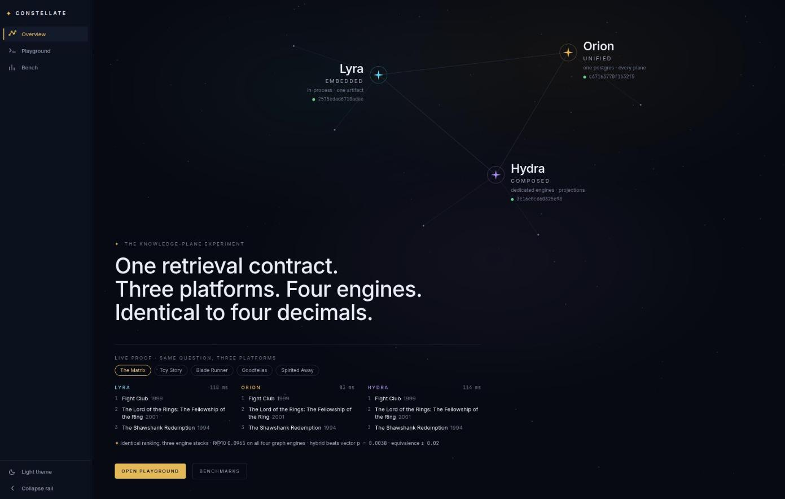
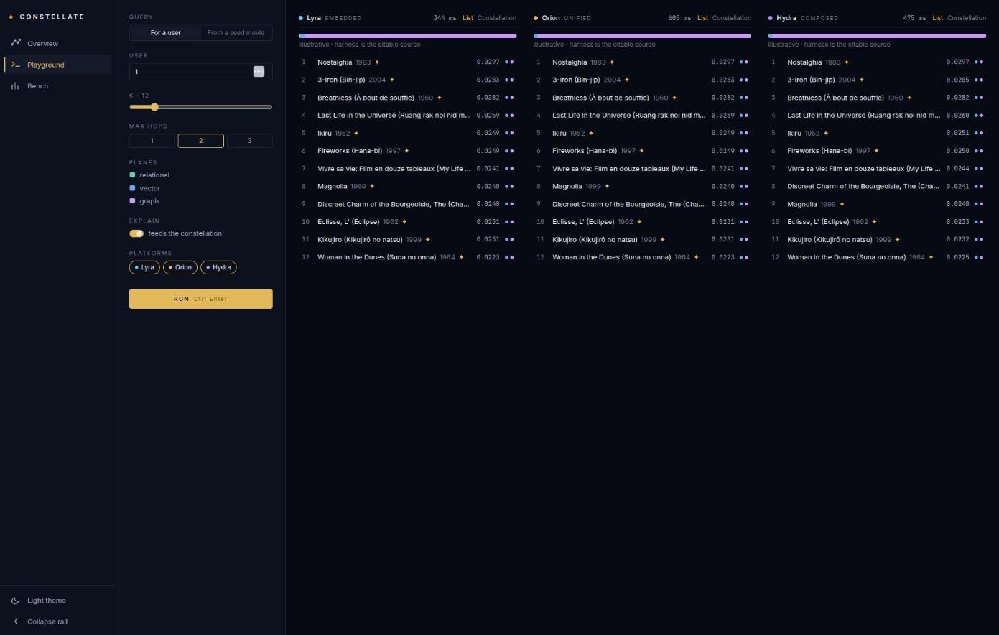

# Constellate

[](https://github.com/rjdscott/constellate/actions/workflows/check.yml)
[](pyproject.toml)
[](LICENSE)

Constellate builds one **knowledge plane** retrieval contract (relational,
vector, and graph candidate generation, fusion, policy gating, and
explainable ranking behind a single API) on three deliberately different
platforms, then benchmarks them head-to-head on MovieLens ml-25m. Everything
runs locally and reproducibly.

The question under test: when does a graph plane earn its place beside
vector search, and how much infrastructure does that take?





## Key findings

- Three graph engines (Kuzu Cypher, Postgres SQL, AGE openCypher) return
  retrieval quality identical to four decimal places. They share a ranking
  contract (ordering keys, tie-breaks), not translations of one query.
  ([findings](docs/research/2026-08-04-knowledge-plane-foundations/08-orion-benchmark-findings.md))
- The embedded, no-daemon platform was expected to win on latency. Measured,
  Postgres over TCP is roughly 3x faster at p50 and keeps scaling with
  concurrency, because synchronous in-process engine calls serialize
  everything.
  ([lessons L3](docs/research/2026-08-04-knowledge-plane-foundations/09-lessons-learned.md))
- Haiku 4.5 scored 1.00 tool-call fidelity on the MCP task suite. A local
  qwen3:8b scored 0.88 overall and 0.00 on multi-step chaining, where it
  produced grounded-looking answers from wrong tool calls.
  ([context-plane comparison](docs/research/2026-08-04-knowledge-plane-foundations/13-context-plane-llm.md))
- Three separate query-planner regressions turned a 70 ms graph expansion
  into a full-graph walk taking minutes, and every correctness test stayed
  green. Conformance suites and production-shaped benchmarks answer
  different questions.
  ([lessons L1](docs/research/2026-08-04-knowledge-plane-foundations/09-lessons-learned.md))

The full set lives in [lessons learned](docs/research/2026-08-04-knowledge-plane-foundations/09-lessons-learned.md)
(L1 to L16) and the numbered findings docs alongside it.

## The constellations

| Key | Platform | is the… | Engines |
|---|---|---|---|
| `lyra` | **Lyra** | embedded knowledge plane | in-process: DuckDB · faiss/hnswlib · Kuzu |
| `orion` | **Orion** | unified knowledge plane | one Postgres 18 (pgvector + edge tables/AGE) |
| `hydra` | **Hydra** | composed knowledge plane | Postgres 18 · Qdrant · Memgraph |
| `eridanus` | **Eridanus** | distributed knowledge plane | CDC/streaming; future, designed after results |

Names are canonical keys everywhere (`PLATFORM=lyra`, `config/lyra.yaml`),
and the architecture terms are their permanent epithets. No hierarchy
implied, just the right tool for the job
([ADR 0009](docs/adr/0009-platform-codenames-constellations.md)).

## What's inside

- **One retrieval contract** (`src/constellate/core/`): candidate
  generation, fusion, policy gating, explainable ranking, with a platform
  adapter per constellation and a conformance suite that pins the semantics.
- **A benchmark harness** (`src/constellate/bench/`, `bench/`): quality
  (nDCG/recall via ir-measures), latency (HdrHistogram percentiles), and a
  dual embedding arm (genome-SVD vs neural,
  [ADR 0006](docs/adr/0006-dual-embedding-ablation-genome-svd-plus-bge.md)).
  Run artifacts are committed under `bench/results/`.
- **A context plane** (`src/constellate/mcp_server.py`,
  `src/constellate/context/`): the same service layer exposed as MCP tools,
  driven by either an API model (Haiku 4.5) or a local one (qwen3:8b via
  Ollama), with deterministic tool-call-fidelity scoring
  ([ADR 0012](docs/adr/0012-context-plane-dual-llm-drivers.md)).
- **An explorer UI** (`ui/`): a React SPA with a constellation graph,
  retrieval playground, and benchmark dashboards. It builds statically from
  committed artifacts (`make ui-snapshot`), so no live API is needed.
- **A documentation pipeline** (`docs/`): research feeds ADRs, ADRs feed
  plans, audits verify, all gated in CI (`make doc-check`). 12 ADRs, 9
  runbooks, every phase resumable by a stranger.

## Getting started

```bash
git clone https://github.com/rjdscott/constellate.git && cd constellate
uv sync
make check                 # ruff + mypy --strict + pytest + doc-check
```

The full loop covers data, engines, and benchmark. Lyra needs no
containers:

```bash
make seed                  # download ml-25m (sha256-pinned) + build canonical parquet
make load PLATFORM=lyra    # project canonical → engine stores
make bench-smoke PLATFORM=lyra
make bench PLATFORM=lyra && make report
```

Orion and Hydra run the same loop after `make up PLATFORM=orion` (docker
compose, throwaway local credentials, nothing secret). Step-by-step:
[local-dev-loop runbook](docs/runbooks/local-dev-loop.md).

The only secret in the whole project is an Anthropic API key, used only by
the context-plane demo's API driver:

```bash
cp .env.example .env       # then fill in ANTHROPIC_API_KEY
uv sync --extra context
uv run python -m constellate.context.suite --driver anthropic --reps 3
```

For a local, keyless alternative via Ollama, see the
[run-context-demo runbook](docs/runbooks/run-context-demo.md).

## Where everything lives

| Surface | Purpose |
|---|---|
| [`docs/research/`](docs/research/2026-08-04-knowledge-plane-foundations/README.md) | Analysis (web-verified, dated snapshots) feeding decisions |
| [`docs/adr/`](docs/adr/README.md) | Decisions: why, with options considered |
| [`docs/plans/`](docs/plans/README.md) | Execution: phased, resumable by a stranger |
| [`docs/runbooks/`](docs/runbooks/README.md) | Operations: how, with exact commands |
| [`docs/audits/`](docs/audits/README.md) | Point-in-time verification sweeps |
| [`CLAUDE.md`](CLAUDE.md) | Working rules (branch/PR discipline, doc pipeline) |

For current status, see the [plan status table](docs/plans/2026-08-04-knowledge-plane/README.md)
and the [migration narrative](docs/research/2026-08-04-knowledge-plane-foundations/04-migration-narrative.md),
the project's running story.

## Data & attribution

Benchmarks run on the [MovieLens ml-25m](https://grouplens.org/datasets/movielens/25m/)
dataset, downloaded at first use (sha256-pinned) and never committed to this
repo. GroupLens's terms prohibit redistribution and commercial use of the
data ([ADR 0001](docs/adr/0001-pin-movielens-ml-25m.md)). If you use results
derived from it, cite:

> F. Maxwell Harper and Joseph A. Konstan. 2015. The MovieLens Datasets:
> History and Context. ACM Transactions on Interactive Intelligent Systems
> (TiiS) 5, 4: 19:1–19:19. <https://doi.org/10.1145/2827872>

The connection-string credentials in `config/` and `compose/` are throwaway
defaults for the local docker services, not secrets.

## License

Code is [MIT](LICENSE). The MovieLens dataset has its own terms (above).
